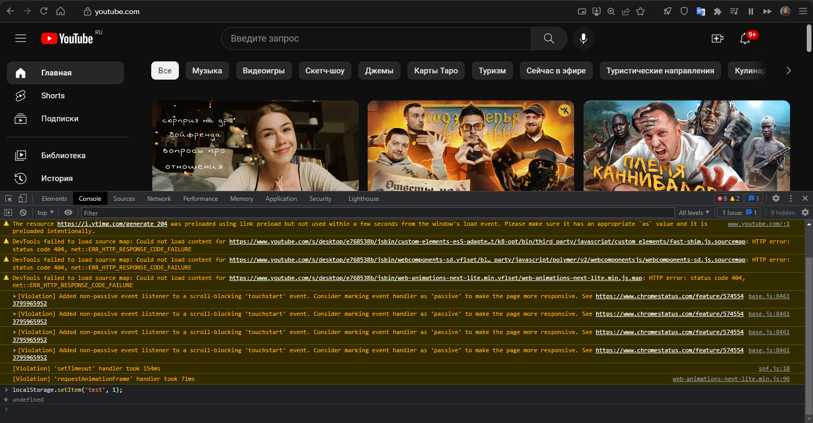
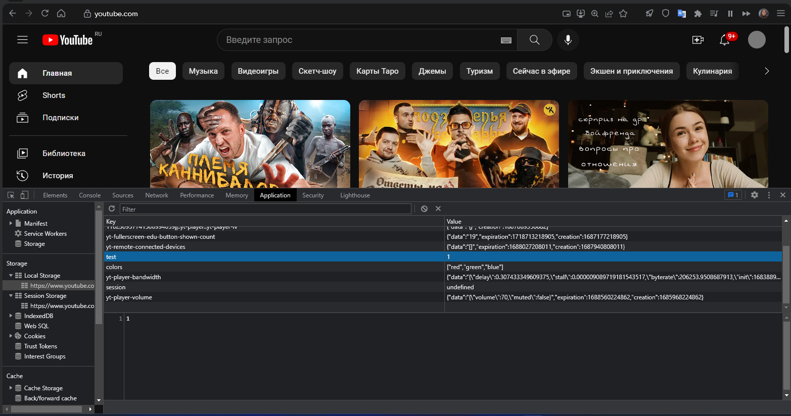
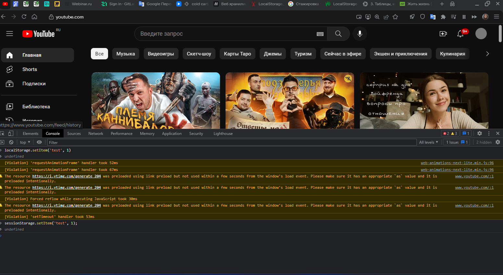
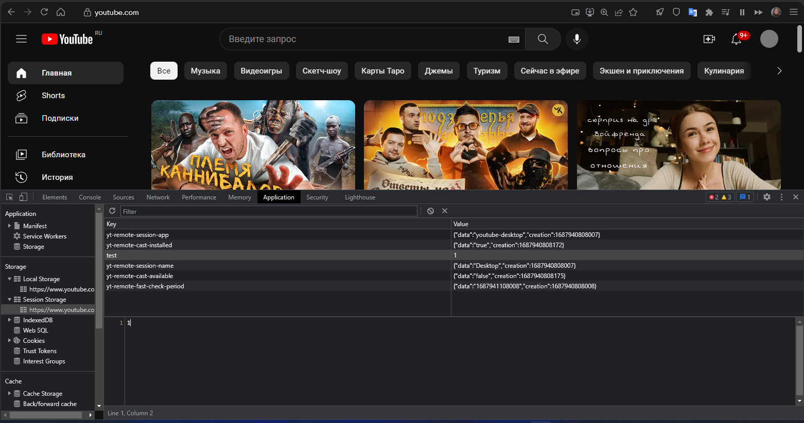

## Local Storage
|Ключ | Значение | Описание |
|----------|----------|----------|
|1.  yt-player-volume|{"data":"{\"volume\":70,\"muted\":false}","expiration":1688560224862,"creation":1685968224862}|Сохраняет данные о громкости используемой в проигрывателе |
|2.  yt-remote-device-id|{"data":"431fea8e-8610-4294-9a28-9ee92ffcf404","expiration":1715423296563,"creation":1683887296563} |Отслеживает ID устройства и действия на странице, нужен для составления рекоммендаций |
|3. yt-player-headers-readable|{"data":"true","expiration":1689352755769,"creation":1686760755769}| Отслеживает просматриваемые видео, а так же заголовки, колличество просмотров и автора видео, так же нужен для составления рекоммендаций |
|4. yt-player-bandwidth|{"data":"{\"delay\":0.11989998372395834,\"stall\":0.0000013188262657174493,\"byterate\":477345.351633614,\"init\":1683889986122.1}","expiration":1690365527385,"creation":1687773527385}|Отслеживает скорость загрузки видео на устройстве, нужен для оптимизации качества видео|
|5. yt-player-sticky-caption|{"data":"false","expiration":1688828575145,"creation":1686236575145}|Отслеживает выбор субтитров, нужен для сохранения выбраного языка и включения его при включеннии следующего видео|

**Результат выполнения команды для добавления и получения объекта в "Local Storage"**   
   
**Состояние "Local Storage" после добавления объекта**   
   

## Session Storage
|Ключ | Значение | Описание |
|----------|----------|----------|
|1. yt-remote-session-app|{"data":"youtube-desktop","creation":1687790180132}|Определяет какое приложение на платформе использовалось, нужен для того чтобы при включении открывалась ранее запущенная страница|
|2. yt-player-autonavstate|{"data":"1","creation":1687772694546}|Определяет на каком времени было остановленно видео, нужен для того чтобы при включении видео в плере оно включалось на моменте, на котором мы остановились |
|3. yt-remote-session-name|{"data":"Desktop","creation":1687790180132}|Определяет автоматически пользователя, нужен для того чтобы не проходить авторизацию каждый раз при обновлении сайта|
|4. yt-remote-cast-installed|{"data":"true","creation":1687790180288}|Определяет какое устройство было использовано в качестве передачи на другое устройство, нужен для того чтобы при повторной передаче сайт видел используемое устройство |
|5. yt-remote-cast-available| {"data":"false","creation":1687790180290}|Определяет возможность передачи видео на другое устройство |

**Результат выполнения команды для добавления и получения объекта в "Session Storage"**   
   
**Состояние "Session Storage" после добавления объекта**   
    