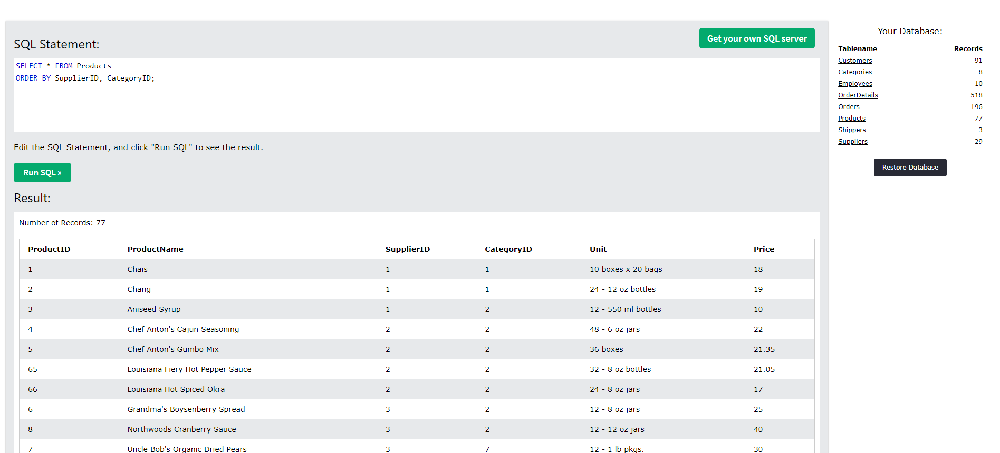

# 1.1 
```
SELECT * FROM Customers  
WHERE Country IN ('Germany','Venezuela');
``` 
Отобраны данные таблицы Customers по странам Германия (Germany) и Венесуэла (Venezuela)


# 1.2 
```
SELECT * FROM Customers
ORDER BY Country, City;
```
Выводит данные всей таблицы Customers отфильтрованные сначала по стране (Country), потом по городу (City)


# 1.3 
```
SELECT City, count(CustomerID) AS number_of_clients FROM Customers
WHERE CustomerName NOT IN ('Around the Horn','Drachenblut Delikatessend')
GROUP BY City
HAVING number_of_clients >= 5;
```
В данном запросе берутся города (City) (в качестве переменной number_of_clients) из таблицы Customers. Полученные данные группируются по городам, а затем остаются только те записи, количество клиентов в которых не менее 5.


# 2.1 
```
SELECT * FROM Categories
WHERE CategoryName NOT IN ('Grains/Cereals','Meat/Poultry');
```
Выводит данные всей таблицы Categories за исключением данных по категориям  Grains/Cereals и Meat/Poultry


# 2.2 
```
SELECT * FROM Categories
ORDER BY Description, CategoryName;
```
Выводит данные всей таблицы Categories отфильтрованные сначала по описанию (Description), потом по названию (CategoryName)


# 2.3 
```
SELECT * FROM Categories
WHERE CategoryName NOT IN ('Grains/Cereals','Meat/Poultry')
ORDER BY CategoryName;
```
Выводит данные всей таблицы Categories за исключением данных по категориям  Grains/Cereals и Meat/Poultry.  Результат  отсортирован  по названию категории (по столбцу CategoryName)


# 3.1 
SELECT * FROM Employees;
Выводит данные всей таблицы Employees

# 3.2 
```
SELECT * FROM Employees
ORDER BY LastName, FirstName;
```
Выводит данные таблицы Employees отфильтрованные сначала по фамилии (LastName), потом по имени (FirstName)

# 3.3
```
SELECT Photo, count(EmployeeID) AS number_of_clients FROM Employees
WHERE LastName NOT IN ('Around the Horn','Drachenblut Delikatessend')
GROUP BY Photo
HAVING number_of_clients <= 5;
```
В данном запросе берутся фото и число клиентов (в качестве переменной number_of_clients) из таблицы Employees. Затем исходная таблица фильтруется по фамилиям клиентов (отсеиваются записи, не подходящие под указанные условия), полученные данные группируются по фото, а затем остаются только те записи, количество клиентов в которых более 5.

# 4.1
SELECT * FROM OrderDetails;
Выводит данные всей таблицы OrderDetails

# 4.2
```
SELECT * FROM OrderDetails
ORDER BY OrderID, ProductID;
```
Выводит данные таблицы OrderDetails отфильтрованные сначала по ID приказа (OrderID), потом по ID продукта (ProductID)

# 4.3
```
SELECT Quantity, count(OrderDetailID) AS number_of_order FROM OrderDetails
WHERE OrderID NOT IN ('Around the Horn','Drachenblut Delikatessend')
GROUP BY Quantity
HAVING number_of_order >= 5;
```
В данном запросе берется колличество и число приказов (в качестве переменной number_of_order) из таблицы OrderDetails. Затем исходная таблица фильтруется по ID приказа (отсеиваются записи, не подходящие под указанные условия), полученные данные группируются по количеству, а затем остаются только те записи, количество приказов в которых не более 5.

# 5.1
SELECT * FROM Orders;
Выводит данные всей таблицы Orders

# 5.2
```
SELECT * FROM Orders
ORDER BY EmployeeID, OrderDate;
```
Выводит данные таблицы Orders отфильтрованные сначала по ID работника (EmployeeID), потом по дате приказа (OrderDate)

# 5.3
```
SELECT EmployeeID, count(OrderDate) AS number_of_employee FROM Orders
WHERE OrderID NOT IN ('Around the Horn','Drachenblut Delikatessend')
GROUP BY EmployeeID
HAVING number_of_employee >= 10;
```
В данном запросе берется id работника и число работников (в качестве переменной number_of_employee) из таблицы Orders. Затем исходная таблица фильтруется по ID приказа (отсеиваются записи, не подходящие под указанные условия), полученные данные группируются по id работника, а затем остаются только те записи, количество работников в которых не более 10.


# 6.1. Таблица: Products. Все записи из таблицы Products, отсортированы сначала по поставщикам (по столбцу SupplierID), затем по категории (по столбцу CategoryID)



# 6.2. Таблица: Products. Из списка записей таблицы Products отобраны данные по поставщикам  ( SupplierID) под номерами 3 и 4.


# 6.3. Таблица: Products. Из списка записей таблицы Products отобраны данные по поставщикам  ( SupplierID) под номерами 3 и 4. Результат отсортирован по стоимости (Price)


# 7.1. Таблица:Shippers.  Все записи из таблицы Shippers, отсортированы  по грузоотправителям (по столбцу ShipperName)


# 7.2. Таблица:Shippers.  Из списка записей таблицы Shippers, отобраны данные по грузоотправителям (столбец ShipperName) за исключением  записи,  подходящие под  условие 'United Package'. Результат отсортированы  по грузоотправителям (по столбцу ShipperName)


# 7.3. Таблица:Shippers.  Из списка записей таблицы Shippers, отобраны данные по грузоотправителям (столбец ShipperName) , подходящим под условие 'Speedy Express'


# 8.1. Таблица: Suppliers. Все записи из таблицы Suppliers, отсортированы сначала по странам (по столбцу Country), затем по городам (по столбцу City)


# 8.2. Таблица: Suppliers. Из списка записей таблицы Suppliers отобраны данные по странам  Germany и USA. Результат  отсортирован сначала по странам (по столбцу Country), затем по городам (по столбцу City)


# 8.3. Таблица: Suppliers. В данном запросе берутся страны (Country)и количество городов (City) (в качестве переменной number_of_city) из таблицы Suppliers. Полученные данные группируются по странам, а затем остаются только те записи, количество городов в которых не менее 2.


